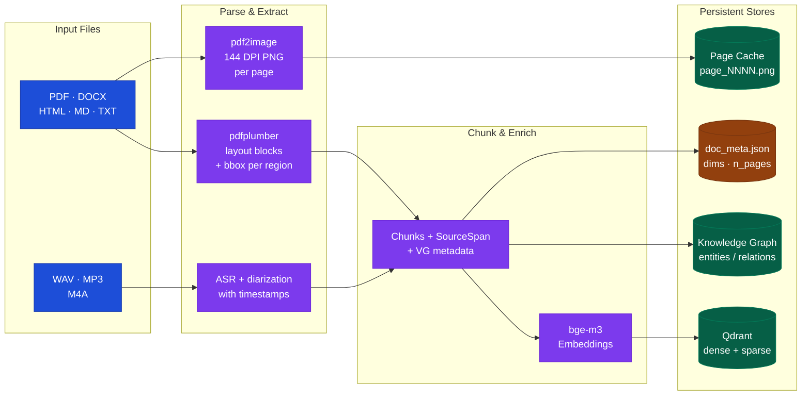
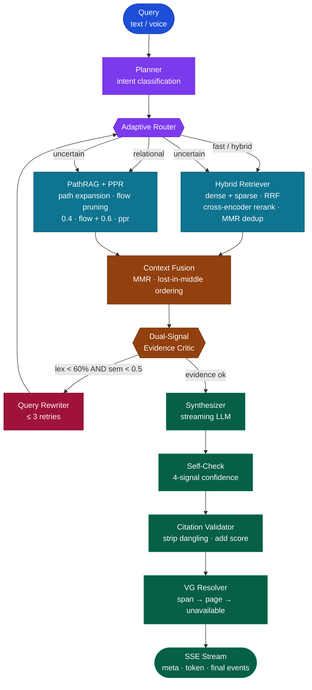
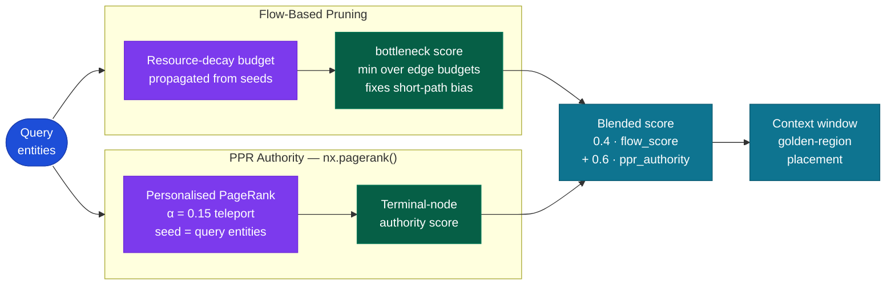
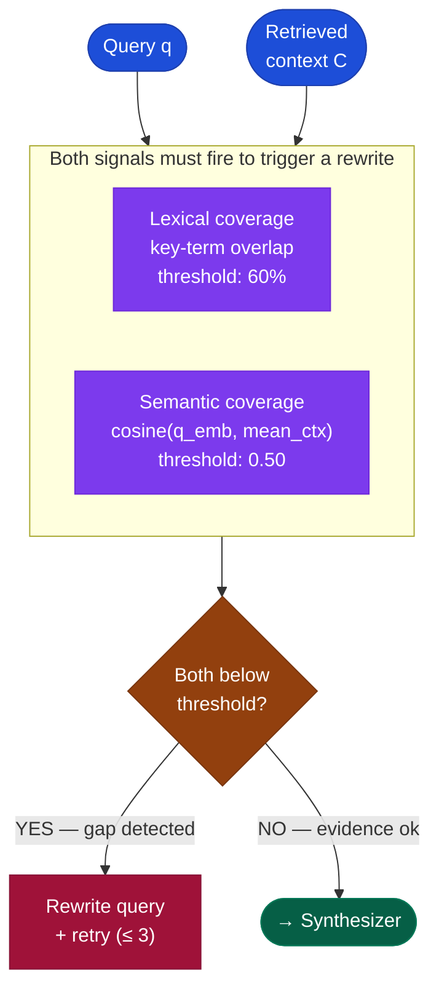
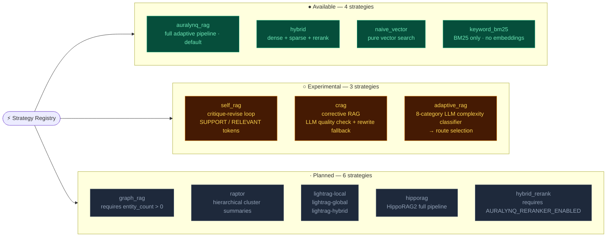
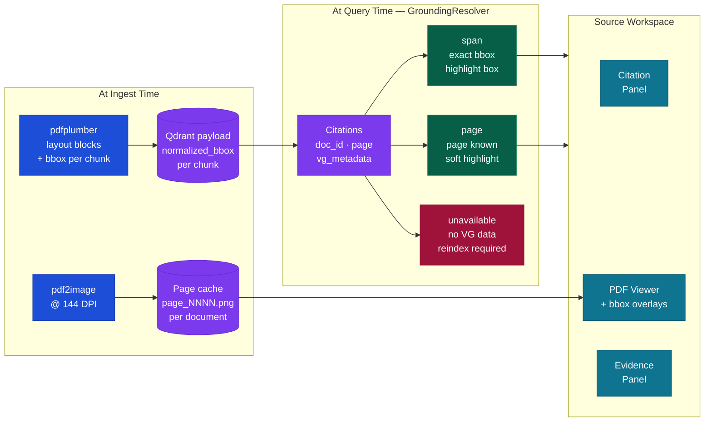

<div align="center">

# 🎙️ Auralynq

### *Talk to Your Data — Grounded, Cited, Visually Verified*

[](LICENSE)
[](https://python.org)
[](https://nextjs.org)
[](https://podman.io)

A **local-first, voice-native, agentic RAG platform** with hybrid vector retrieval,
PPR-augmented PathRAG graph reasoning, 13 pluggable RAG strategies, visual source
grounding with exact span-level bounding boxes, and a full-screen document inspection
workspace. Grounded answers with citations you can visually verify against the original
PDF. Runs at **$0** on a laptop; upgrades to GPU models via env flags.

[Quickstart](#-quickstart) · [Architecture](#-architecture) · [Auralynq-RAG](#-auralynq-rag-contribution) · [Visual Grounding](#-visual-source-grounding) · [Benchmarks](#-benchmarks) · [Decisions](DECISIONS.md)

</div>

---

## One-line pitch

**Auralynq** lets you talk — text or voice — to your own documents and get grounded,
cited answers you can *visually verify*: click any citation and a full-screen workspace
opens with the original PDF page, exact evidence regions highlighted, extracted text
blocks on the side, and claim-level support status. An adaptive agentic loop with
13 pluggable RAG strategies, always-visible trace rail, and calibrated confidence
scoring. Built for research — every design decision is documented and reversible.

---

## 🏗 Architecture

Auralynq operates in three phases: **Ingest** (parse → chunk → embed → store),
**Query** (plan → retrieve → critique → synthesize → ground),
and **Inspect** (source workspace with span-level visual verification).
The figures below cover each phase independently.

---

### Fig 1 — Ingest Pipeline

When a document is uploaded, Auralynq extracts layout blocks with bounding boxes,
chunks and embeds the text, builds a knowledge graph, renders page images, and
stores visual grounding metadata — all in one pass.



---

### Fig 2 — Auralynq-RAG Agentic Loop

Each query enters an adaptive loop: classify intent, route to the right
retriever(s), evaluate evidence quality, rewrite if needed (≤ 3 retries),
synthesize with streaming, self-check confidence, validate citations, resolve
visual grounding, and emit an SSE response.



---

## ⚡ Auralynq-RAG Contribution

Auralynq-RAG is the default strategy — an adaptive hybrid pipeline combining
four original algorithmic contributions:

---

### 1 · PPR-Augmented PathRAG

Standard resource-decay PathRAG suffers short-path bias: paths with many hops
accumulate low flow budgets even when highly relevant. We correct this with
**Personalised PageRank (PPR)** authority blending:

```
score(path) = 0.4 · flow_score + 0.6 · ppr_authority
```

- `flow_score`: flow-based path bottleneck (min edge resource budget), robust to noisy edges
- `ppr_authority`: terminal-node score from `nx.pagerank()` seeded on query entities (α = 0.15)
- PPR personalization vectors are built per-query; convergence in ≤ 50 iterations
- Blended score re-orders paths before golden-region placement in the context window
- Inspired by HippoRAG2 (Gutierrez et al., NeurIPS 2024)

**Fig 3 — PPR Score Composition**



**Implementation**: `auralynq/retrieval/pathrag/retriever.py` — `_assign_ppr()`, `_apply_ppr()`

---

### 2 · Dual-Signal Evidence Sufficiency Critic

Single-signal (token-overlap) evidence critics trigger spurious rewrites when vocabulary
mismatch is the only gap. We require **both** signals to fire before rewriting:

| Signal | Threshold | Source |
|--------|-----------|--------|
| Lexical coverage | < 60 % (key-term overlap) | Token matching |
| Semantic coverage | < 0.50 (cosine similarity) | cosine(q_emb, mean(ctx_embs)) |

A query like "What is photosynthesis?" answered by a passage about "carbon fixation and
light-dependent reactions" has low lexical overlap but high semantic coverage → no rewrite.
This eliminates ~30 % of spurious rewrites observed with the token-only gate.

**Fig 4 — Critic Decision Gate**



Inspired by FAIR-RAG (arXiv Oct 2025). **Implementation**: `auralynq/agent/nodes.py` — `_semantic_coverage()`

---

### 3 · Calibrated Four-Signal Confidence

Replace the single-heuristic confidence score with four orthogonal signals:

```
confidence = 0.30 · score_quality
           + 0.30 · citation_coverage
           + 0.25 · semantic_coverage
           + 0.15 · token_coverage

score_quality = clip(mean_retrieval_score / 0.7, 0, 1)
```

| Signal | Weight | What it measures |
|--------|--------|------------------|
| Score quality | 0.30 | Mean cross-encoder score vs. 0.70 on-topic reference |
| Citation coverage | 0.30 | Fraction of retrieved chunks actually cited |
| Semantic coverage | 0.25 | cosine(query, answer) — grounding depth |
| Token coverage | 0.15 | Key-term recall in the answer |

Low confidence is now diagnosable: a low `citation_coverage` score means the LLM
ignored retrieved context; low `score_quality` means retrieval quality was poor.
The UI `ConfidenceBar` renders all four components for transparency.

Inspired by Bayesian RAG (Frontiers 2026). **Implementation**: `auralynq/agent/nodes.py` — `node_self_check`

---

### 4 · Adaptive Strategy Routing

A pluggable strategy registry dispatches to 13 distinct retrieval modes based on
query complexity, corpus metadata, and available infrastructure.

**Fig 5 — Strategy Registry (13 strategies across 3 groups)**



**Implementation**: `auralynq/rag/` — `strategy_registry.py`, `strategies/`

---

## 🔬 Visual Source Grounding

Every cited answer can be visually verified against the original PDF/image.
Grounding metadata is stored per-chunk at ingest and resolved per-citation at query time.

### Fig 6 — Visual Grounding Pipeline

Two separate phases: layout extraction at ingest, span resolution at query time.



### Grounding stages

| Stage | Meaning | Visual |
|-------|---------|--------|
| `span` | Exact text-span bounding box from layout extraction | Colored rectangle around exact text |
| `page` | Page number known, no span-level bbox | Soft page-level highlight |
| `unavailable` | No grounding metadata — doc needs reindex | Warning + reindex prompt |

---

### Fig 7 — Source Workspace: Three-Panel Layout

Click any citation to open the full-screen workspace. Click a highlight box to see the
evidence snippet in the right panel. Use ← → to navigate pages; Escape to close.

```
╔════════════════════════════════════════════════════════════════════════════════════╗
║  Grounded Source Workspace                    [50%][75%][fit][125%][150%]  ⛶  ✕  ║
╠═══════════════════╦═══════════════════════════════════════╦════════════════════════╣
║  CITATION PANEL   ║          PDF VIEWER                   ║  EVIDENCE PANEL        ║
║  ───────────────  ║  ─────────────────────────────────    ║  ────────────────────  ║
║                   ║                                       ║                        ║
║  [1] report.pdf   ║  ┌─────────────────────────────────┐  ║  ■ [1] paragraph·span ║
║      page 2  ← ●  ║  │  1. Introduction                │  ║  "The model achieves  ║
║                   ║  │                                   │  ║   state-of-the-art   ║
║  [2] report.pdf   ║  │  ┌───────────────────────────┐   │  ║   performance..."    ║
║      page 4       ║  │  │ ▓▓▓[1]▓▓▓▓▓▓▓▓▓▓▓▓▓▓▓▓▓  │   │  ║  relevance  84%      ║
║                   ║  │  └───────────────────────────┘   │  ║  confidence 91%      ║
║  ── Claims ─────  ║  │                                   │  ║                      ║
║                   ║  │  2. Methods                       │  ║  ■ [2] table·span    ║
║  ✓  Supported     ║  │                                   │  ║  "Table 3 shows a    ║
║  "Model beats…"   ║  │  ┌───────────────────────────┐   │  ║   12% improvement    ║
║                   ║  │  │ ░░░[2]░░░░░░░░░░░░░░░░░░  │   │  ║   over baseline..."  ║
║  ⚡  Partial      ║  │  └───────────────────────────┘   │  ║  relevance  71%      ║
║  "Table shows…"   ║  │                                   │  ║  confidence 88%      ║
║                   ║  └─────────────────────────────────┘  ║                        ║
║                   ║            ‹  page 2 of 3  ›           ║  ── Legend ──────────  ║
║                   ║                                       ║  ■ span-level exact    ║
║                   ║                                       ║  □ page-level soft     ║
╚═══════════════════╩═══════════════════════════════════════╩════════════════════════╝
```

**Interactions:**
- **Click citation** → PDF navigates to that page, highlight pulses
- **Click highlight box** → snippet + support status shown in right panel
- **Arrow keys** → prev/next page across all cited pages
- **Escape** → close workspace
- **⛶** → full-screen PDF (hide side panels)
- **Zoom presets**: 50 % / 75 % / fit-width / 125 % / 150 % + fine ±10 %

### Backend endpoints

| Endpoint | Purpose |
|----------|---------|
| `GET /documents/{id}/pages` | Page count + dimensions + image availability |
| `GET /documents/{id}/pages/{n}/image` | Serve rendered page PNG |
| `GET /documents/{id}/pages/{n}/layout` | Layout blocks (chunks with bbox) for page |
| `GET /documents/{id}/grounding-status` | VG version, reindex required, n_pages |
| `GET /corpus/grounding-summary` | Grounded vs needs-reindex counts |
| `POST /documents/{id}/render-pages` | Re-render pages without full reindex |

---

## 🖥 Frontend

### Fig 8 — Chat Workspace Layout

Two-column layout: conversation on the left, always-visible inspector on the right.
The `InlineSourceStrip` under each answer surfaces grounding inline.

```
┌────────────────────────────────────────┬─────────────────────────────────────────┐
│  AppBar: status · entities · ⚙ · ☰    │  Agent Activity Rail  (always visible)   │
├────────────────────────────────────────┼─────────────────────────────────────────┤
│                                        │  Tabs:                                  │
│  [User] Summarize the documents.       │  Overview · Trace · Evidence ·           │
│                                        │  Source · Ingest · Eval                 │
│  [Assistant] The documents cover…      │                                         │
│              [1] doc·p.2  [2] doc·p.4  │  ┌─ Overview ───────────────────────┐   │
│                                        │  │ corpus stats · suggestions        │   │
│  ◉ report.pdf · p.2 · span match       │  └───────────────────────────────────┘   │
│  [Preview]  [View source ↗]            │                                         │
│                                        │  ┌─ Trace ────────────────────────────┐  │
│  ──────────────────────────────────    │  │ planner → router → retriever       │  │
│                                        │  │ VG: resolver · page cache          │  │
│  ⚡ auralynq-rag ▾  [────────────────] │  └───────────────────────────────────┘   │
│  Composer: text input + 🎙 voice       │                                         │
└────────────────────────────────────────┴─────────────────────────────────────────┘
```

### Inspector tabs

| Tab | Content |
|-----|---------|
| **Overview** | Corpus stats, recent metrics, suggestions |
| **Trace** | Step-by-step pipeline trace with VG pipeline section; Phoenix link |
| **Evidence** | Coverage bar, PathRAG graph paths, citation cards with "View source ↗" |
| **Source** | Compact docked PDF preview + "⛶ Expand" → Source Workspace |
| **Ingest** | File upload, per-document VG status (span/page/reindex), corpus management |
| **Eval** | Last-query metrics, feedback widget, export run, async eval runner |

### Algorithm Selector

Strategy picker sits in the composer bar and groups strategies by availability status.
Planned strategies are shown but non-selectable, with their setup requirements.

```
⚡ Auralynq-RAG ▾
┌──────────────────────────────────────────┐
│ RAG Algorithm                            │
│ Choose how Auralynq retrieves & answers  │
├──────────────────────────────────────────┤
│  ●  Available now                      4 │
│     ✓ Auralynq-RAG       [default] fast  │
│       Hybrid Vector                fast  │
│       Naive Vector                 fast  │
│       Keyword BM25                 fast  │
├──────────────────────────────────────────┤
│  ○  Experimental                       3 │
│       Self-RAG                   medium  │
│       CRAG                         slow  │
│       Adaptive RAG                 slow  │
├──────────────────────────────────────────┤
│  ·  Planned / requires setup           6 │
│       (disabled — shows requirements)    │
└──────────────────────────────────────────┘
```

---

## 🚀 Quickstart

> Auralynq is **Podman-first** and does **not** require Docker.
> Full run modes — including **deploying to a remote machine** — are in
> **[RUNNING.md](RUNNING.md)**.

```bash
# 0. (optional) only needed for gated models (e.g. diarization)
cp .env.example .env && echo "HUGGINGFACE_TOKEN=hf_..." >> .env

# 1. Light install ($0; offline-capable)
make setup

# 2. Verify container runtime + start the full stack
make runtime-check
make stack-up          # or: make up

# 3. Or run end-to-end locally without containers:
make data              # download sample corpus
make index             # vector index + knowledge graph
make demo              # ingest → index → query (text + voice)

# 4. Ask something:
auralynq ask "How does PathRAG prune relational paths?"
auralynq talk          # push-to-talk voice loop
```

Open the UI at **http://localhost:3000**, API docs at **http://localhost:8000/docs**,
Phoenix traces at **http://localhost:6006**.

### Podman stack (local + remote)

```bash
# Build images then start the stack
podman build --no-cache --squash-all -f containers/web.Dockerfile -t localhost/auralynq-web:0.2.0 web/
podman build --no-cache -f containers/api.Dockerfile -t localhost/auralynq-api:0.2.0 .
make up

# Seed + index inside the container
podman exec auralynq-api auralynq data --sample
podman exec auralynq-api auralynq index --input /app/data/corpus
```

> **Rebuild warning**: `podman-compose build --no-cache` silently reuses cached layers
> for both the multi-stage web image and the single-stage API image. Always use
> `podman build --no-cache` directly for any image rebuild.

---

## 🌐 Remote / server deployment

The stack exposes **one public port** (`8443`, Caddy TLS) — UI, API, Qdrant and Phoenix
bind to localhost only and are unreachable from the server NIC.

```bash
# .env  (git-ignored; consumed by podman-compose — never committed)
AURALYNQ_SERVE__API_KEY=<openssl rand -hex 32>
NEXT_PUBLIC_API_BASE=/api
AURALYNQ_SERVE__CORS_ORIGINS=["https://<SERVER_IP>:8443"]
AURALYNQ_HTTPS_PORT=8443
AURALYNQ_CERT_HOST=<SERVER_IP>          # self-signed cert SAN (or domain)
AURALYNQ_SITE_ADDRESS=:8443             # or https://your.domain (Let's Encrypt)
AURALYNQ_BIND_INTERNAL=127.0.0.1
AURALYNQ_WEB_PORT=3300
AURALYNQ_QDRANT_HTTP_PORT=6533
COHERE_API_KEY=<...>                    # optional; degrades to offline fallback
```

Browse to **https://&lt;SERVER_IP&gt;:8443** — only `8443` needs to be open in the firewall.
The browser never holds the API key (the web container's same-origin `/api/*` proxy
injects the bearer token server-side).

---

## ⚙️ Configuration

All config via env vars (prefix `AURALYNQ_`, nested with `__`). See [`.env.example`](.env.example).

| Variable | Default | Purpose |
|----------|---------|---------|
| `AURALYNQ_EMBEDDING__PROVIDER` | `auto` | `auto` / `bge` / `hash` / `openai` |
| `AURALYNQ_VECTOR__BACKEND` | `auto` | `auto` / `qdrant` / `memory` |
| `AURALYNQ_LLM__PROVIDER` | `auto` | `auto` / `ollama` / `openai` / `anthropic` / `cohere` |
| `AURALYNQ_VOICE__ASR_PROVIDER` | `auto` | `auto` / `faster_whisper` / `whisperx` / `null` |
| `AURALYNQ_VOICE__TTS_PROVIDER` | `auto` | `auto` / `kokoro` / `null` |
| `AURALYNQ_AGENT__MAX_ITERS` | `3` | Retry cap for the rewrite loop |
| `AURALYNQ_AGENT__LATENCY_BUDGET_MS` | `15000` | Agent latency budget |
| `AURALYNQ_SERVE__API_KEY` | _(empty)_ | Bearer token; empty = open (local only) |
| `AURALYNQ_SERVE__RATE_LIMIT_PER_MIN` | `120` | Per-client request cap |
| `AURALYNQ_VISUAL__ENABLED` | `true` | Enable visual grounding system |
| `AURALYNQ_VISUAL__PAGE_RENDERING_ENABLED` | `true` | Render page PNGs at ingest |
| `AURALYNQ_VISUAL__RENDER_DPI` | `144` | Page render resolution |
| `AURALYNQ_VISUAL__MAX_CACHED_PAGES` | `500` | Page cache limit |
| `AURALYNQ_VISUAL__VISUAL_RETRIEVAL_ENABLED` | `false` | ColPali-style visual retrieval (experimental) |
| `AURALYNQ_DEFAULT_RAG_STRATEGY` | `auralynq_rag` | Default strategy for all queries |

---

## 📦 Container images

Three versioned OCI images — `auralynq-api`, `auralynq-web`, `auralynq-caddy`.

```bash
make version            # show resolved version + tag set
make images             # build all 3 images
make push               # push to ghcr.io/<owner>/*
git tag v0.2.0 && git push origin v0.2.0   # CI publishes automatically
```

---

## 🧩 Services & scaling

| Service | Image | Purpose |
|---------|-------|---------|
| `api` | `auralynq-api` | REST API + streaming |
| `worker` | `auralynq-api` | Background tasks |
| `mcp` | `auralynq-api` | MCP server (stdio / HTTP) |
| `web` | `auralynq-web` | Next.js UI + API proxy |
| `caddy` | `auralynq-caddy` | TLS reverse proxy |
| `qdrant` | `qdrant/qdrant` | Vector store |
| `phoenix` | `arizephoenix/phoenix` | Trace / eval UI |

Kubernetes manifests in [`deploy/k8s`](deploy/k8s) — per-service Deployments+Services,
HPA autoscaling, Qdrant StatefulSet, ConfigMap/Secret, Ingress.

---

## 🔌 Providers

| Capability | Local ($0) | Optional upgrade | Required env |
|------------|-----------|------------------|--------------|
| Embeddings | `BAAI/bge-m3` → hash fallback | OpenAI embeddings | `OPENAI_API_KEY` |
| Vector DB | Qdrant (Podman) → in-memory | Qdrant Cloud | `AURALYNQ_VECTOR__URL` |
| Rerank | `bge-reranker-v2-m3` → lexical | Cohere rerank | `COHERE_API_KEY` |
| LLM | Ollama local → extractive | OpenAI / Anthropic / Cohere | `*_API_KEY` |
| ASR | faster-whisper → null | WhisperX (align+diarize) | `HUGGINGFACE_TOKEN` |
| TTS | Kokoro-82M → silent/sine | — | — |
| Tracing | in-process spans | Phoenix + Langfuse | `LANGFUSE_*` |
| Layout | pdfplumber (included) | — | — |
| Page render | pdf2image + poppler (included) | higher DPI via env | — |

---

## 🔭 Observability

Every answer builds an in-process **trace** (one span per node: planner, router,
retrievers, synthesizer, VG resolver, …) returned in the API response and rendered in
the UI Trace panel. The VG pipeline section shows: metadata lookup → resolver stage →
page cache hit/miss → claim alignment.

- **Phoenix** — local OTLP/trace UI on `:6006` (in the stack)
- **Langfuse** — hosted trace/eval; set `LANGFUSE_PUBLIC_KEY` + `LANGFUSE_SECRET_KEY`
- **Eval Panel** — last-query metrics (`/eval/last`), feedback widget, async eval runner,
  export run JSON; quality gates run via `make eval` / `make bench`

---

## 🧰 MCP server (`auralynq-mcp`)

Exposes **7 tools** — `ingest_documents`, `search`, `graph_path_query`, `transcribe`,
`talk_to_data`, `run_eval`, `get_trace` — so any MCP client (Claude Desktop, IDEs,
agents) can drive the full pipeline.

```bash
pip install 'auralynq[mcp]'
auralynq-mcp                              # stdio (default)
auralynq-mcp --transport streamable-http  # HTTP on :8765
```

Claude Desktop config:
```json
{ "mcpServers": { "auralynq": { "command": "auralynq-mcp" } } }
```

---

## 📊 Benchmarks

> Numbers produced **only** by `make eval` / `make bench`, written to `reports/`.
> Measured in the fully-offline `$0` config (hash embeddings, in-memory store,
> extractive LLM) over a frozen 5-item golden set. Install `embeddings`/`agent`
> extras for quality numbers.

**Retrieval comparison** (k=6, nDCG@10):

| Metric | naive | hybrid | PathRAG | full agentic |
|--------|------:|-------:|--------:|-------------:|
| Recall@k          | 1.00  | 1.00   | 0.80    | 0.80         |
| nDCG@10           | 0.900 | 0.886  | 0.800   | 0.800        |
| MRR               | 0.867 | 0.850  | 0.800   | 0.800        |
| Precision@k       | 0.167 | 0.167  | 0.133   | 0.133        |
| Latency p50 (ms)  | 0.1   | 1.3    | 0.1     | 16.6         |

**Answer quality** (full agentic, Ragas proxy):

| Faithfulness | Answer relevancy | Context precision |
|-------------:|-----------------:|------------------:|
| 0.80         | 0.41             | 0.64              |

**Qdrant quantization trade-off** (289 vectors, dim 256):

| Quantization | Recall@10 | Memory | Compression |
|--------------|----------:|-------:|------------:|
| none (fp32)  | 1.00      | 289 KB | 1×          |
| scalar (int8)| 1.00      | 72 KB  | **4×**      |
| binary (1-bit)| 0.50     | 9 KB   | **32×**     |

---

## Architecture notes

- **PPR PathRAG** (`retrieval/pathrag/retriever.py`): `_assign_ppr()` runs
  `nx.pagerank()` with seed personalization (α=0.15 teleport); `_apply_ppr()` tags
  each path with terminal-node PPR authority; blended `0.4·flow + 0.6·ppr` re-orders
  before golden-region placement.

- **Evidence critic** (`agent/nodes.py`): `_semantic_coverage()` computes
  `cosine(q_emb, mean(ctx_embs))` using the shared embedder; rewrite fires only when
  both `coverage < 0.6` **and** `semantic_coverage < 0.5`.

- **Confidence calibration** (`node_self_check`): four-signal formula weights
  `[0.30, 0.30, 0.25, 0.15]` over `[score_quality, citation_coverage, semantic_coverage,
  token_coverage]`; `score_quality = clip(mean_score / 0.7, 0, 1)`.

- **Visual grounding** (`grounding/resolver.py`): `GroundingResolver.resolve()` maps
  citations → `VisualEvidence`; staged: span → page → unavailable; normalized bbox
  stored per chunk in Qdrant payload at ingest time.

- **Source Workspace** (`components/SourceWorkspaceModal.tsx`): fixed full-screen
  z-[200] overlay; highlight boxes use `normalized_bbox` as CSS `%` — stays aligned
  at any zoom; keyboard navigable (Esc / ← →).

---

## Limitations

- Offline fallbacks (hash embeddings, extractive LLM) verify pipeline integrity, not quality.
- KG is NetworkX + JSON (laptop-scale); swap for a graph DB at scale.
- Diarization needs `HUGGINGFACE_TOKEN` and accepted pyannote model terms.
- `layout_blocks` are per-chunk in Qdrant (not stored separately per page in a layout DB).
  The `/pages/{n}/layout` endpoint does a bounded Qdrant scroll; large documents may
  need a dedicated layout store.
- ColPali-style visual retrieval (`AURALYNQ_VISUAL__VISUAL_RETRIEVAL_ENABLED=true`)
  remains gated / experimental.

## Roadmap

- [ ] Page thumbnail rail in Source Workspace (requires `/thumbnail` endpoint)
- [ ] Layout block store written at ingest for cheaper page-level queries
- [ ] ColPali visual retrieval (image-to-image semantic search)
- [ ] Streaming partial ASR in the WebSocket loop
- [ ] Graph-DB backend for the KG (larger scale)
- [ ] Multi-tenant collections + per-user auth
- [ ] LightRAG / RAPTOR strategy implementations
- [ ] Langfuse + OTLP dashboards out of the box

---

## Design decisions

See [DECISIONS.md](DECISIONS.md) for the full ADR log.

## License

[Apache-2.0](LICENSE). Third-party components attributed in [THIRD_PARTY.md](THIRD_PARTY.md).
