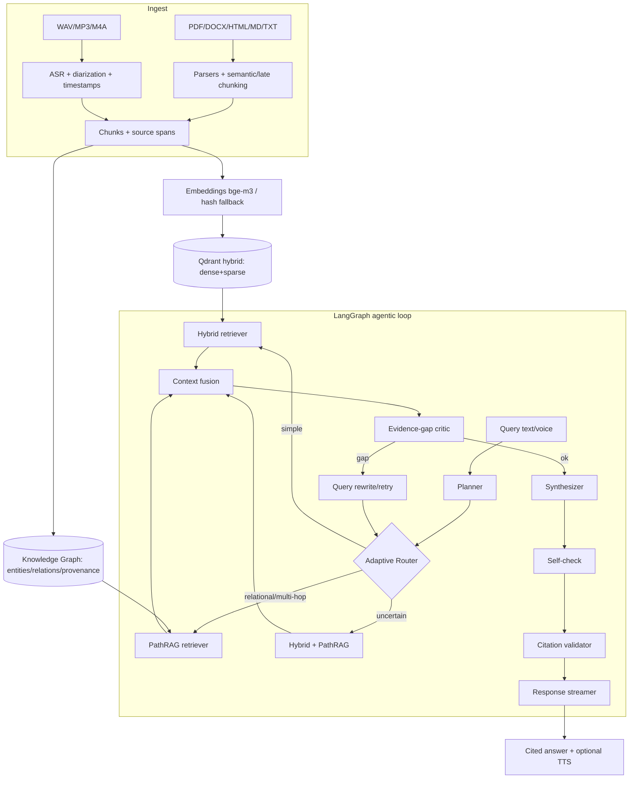

<div align="center">

# 🎙️ Auralynq

### *Talk to Your Data*

A **local-first, agentic, voice-enabled RAG platform** with hybrid vector retrieval,
a relational knowledge graph, and **PathRAG** graph reasoning — grounded answers with
citations, source spans, speaker labels, and timestamps. Runs at **$0** on a laptop;
upgrades to GPU models and paid providers via environment variables.

[Quickstart](#-quickstart-podman) · [Architecture](#-architecture) · [Benchmarks](#-benchmarks) · [Decisions](DECISIONS.md) · [Attributions](THIRD_PARTY.md)

</div>

---

## One-line pitch

**Auralynq** lets you talk — by text or voice — to your own documents and audio, and
get grounded, cited answers, optionally spoken back, with an adaptive agent that routes
simple queries to fast hybrid retrieval and relational/multi-hop queries to PathRAG.

## Demo


> `docs/demo.gif` is a placeholder — generate it with `make demo` then record the UI.

## Why this is technically interesting

- **Adaptive agentic loop** (LangGraph) with explicit latency budgets, iteration caps,
  an evidence-gap critic, query-rewrite retries, self-check, and a citation validator that
  keeps unsupported claims out of answers.
- **PathRAG** graph retrieval — relational path expansion with **flow-based pruning**,
  path-reliability scoring, and golden-region path-to-text ordering.
- **Hybrid retrieval** — dense + sparse vectors, reciprocal rank fusion, cross-encoder
  reranking, MMR de-duplication, and lost-in-the-middle reordering.
- **Voice-native** — push-to-talk → VAD → ASR → agent → grounded answer → TTS, with
  **speaker-aware, timestamped citations**.
- **Runs at $0** — every heavy/paid backend (bge-m3, Qdrant, Whisper, pyannote, Kokoro,
  langgraph, ragas) is optional and has a deterministic offline fallback (see
  [ADR-0003](DECISIONS.md)). Upgrading is a config flag, not a code change.
- **Honest evaluation** — every benchmark number is produced by `make eval`/`make bench`.

## 🏗 Architecture



See [DECISIONS.md](DECISIONS.md) for the architectural rationale.

## 🚀 Quickstart (Podman)

> Auralynq is **Podman-first** and does **not** require Docker.
> Full run modes — including **deploying to a different machine** — are in
> **[RUNNING.md](RUNNING.md)**.

```bash
# 0. (optional) only needed for gated models/datasets (e.g. diarization)
cp .env.example .env && echo "HUGGINGFACE_TOKEN=hf_..." >> .env

# 1. Install (light deps; $0; offline-capable)
make setup

# 2. Verify container runtime + start the full stack (Qdrant, API, worker, UI, Phoenix)
make runtime-check
make stack-up

# 3. Or run end-to-end locally without containers:
make data        # download sample text + voice datasets
make index       # build vector index + knowledge graph
make demo        # ingest -> index -> ask (text + voice), prints cited answers

# 4. Ask something:
auralynq ask "How does PathRAG prune relational paths?"
auralynq talk    # push-to-talk voice loop
```

Open the UI at **http://localhost:3000**, the API docs at **http://localhost:8000/docs**,
and Phoenix traces at **http://localhost:6006**.

## 🌐 Remote / server deployment

The stack is **hardened for remote exposure** ([ADR-0012](DECISIONS.md)/[0013](DECISIONS.md)/[0014](DECISIONS.md)):

- **One public port** — a **Caddy TLS reverse proxy** on `:8443` is the *only*
  service bound to `0.0.0.0`. UI, API, Qdrant and Phoenix bind to **localhost only**
  (verified unreachable from the server IP).
- **HTTPS** with a self-signed cert (server IP + localhost as SANs) baked into the
  Caddy image; set `AURALYNQ_SITE_ADDRESS=https://your.domain` for a real domain.
- **API auth** via bearer token; the browser never holds the key — the web
  container's same-origin `/api/*` proxy injects it server-side.
- **Rootless container DNS without sudo** — `make stack-up` pins the CNI conflist
  to `0.4.0` + adds the `dnsname` plugin, so services resolve each other by
  `container_name` ([ADR-0014](DECISIONS.md)).

Put deployment values in a git-ignored `.env` (read by `podman-compose`):

```bash
# .env  (git-ignored; consumed by podman-compose — never committed)
# --- API auth: generate once, e.g. `openssl rand -hex 32` (do NOT commit) ---
AURALYNQ_SERVE__API_KEY=<random-secret>
# --- browser uses the same-origin proxy; no IP/secret baked into the bundle ---
NEXT_PUBLIC_API_BASE=/api
AURALYNQ_SERVE__CORS_ORIGINS=["https://<SERVER_IP>:8443"]
# --- TLS proxy (single public port) ---
AURALYNQ_HTTPS_PORT=8443
AURALYNQ_CERT_HOST=<SERVER_IP>     # self-signed cert SAN (or your domain)
AURALYNQ_SITE_ADDRESS=:8443        # or https://your.domain for Let's Encrypt
# --- internal services bind here (loopback = off the public NIC) ---
AURALYNQ_BIND_INTERNAL=127.0.0.1
AURALYNQ_WEB_PORT=3300             # loopback-only, for host debugging
AURALYNQ_QDRANT_HTTP_PORT=6533
# --- optional commercial providers (auto-detected; runtime errors degrade to
#     the offline extractive answerer, never a 500) ---
COHERE_API_KEY=<...>        # OPENAI_API_KEY / ANTHROPIC_API_KEY / HUGGINGFACE_TOKEN
```

```bash
# Build images (web bakes NEXT_PUBLIC_API_BASE=/api; caddy bakes the cert), then
# bring up the hardened stack (handles the no-sudo CNI DNS fix automatically):
podman-compose build
make stack-up

# Seed data + build the index inside the API container (writes the named volume):
podman exec auralynq-api auralynq data --sample
podman exec auralynq-api auralynq index --input /app/data/corpus
```

Then browse to **https://&lt;SERVER_IP&gt;:8443** (accept the self-signed cert) —
chat/voice/trace all work through the proxy with no client-side key. **Only `8443`
needs to be open in the firewall**; UI/API/Qdrant/Phoenix are not reachable from
the server IP.

**Notes**
- Self-signed cert → browsers show a one-time warning; use a domain + `AURALYNQ_SITE_ADDRESS`
  for a trusted cert (Caddy auto-provisions Let's Encrypt).
- Voice from the browser mic needs a real ASR engine in the API image; it ships
  faster-whisper (the base model downloads on the first `/voice` request).
- `podman-compose` (v1) pins image IDs across partial `up`s — after rebuilding an
  image, do a full `down` then `make stack-up`.

## 📦 Container images & releases

Three versioned, OCI-labelled images — `auralynq-api`, `auralynq-web`,
`auralynq-caddy` — published to **GHCR** ([ADR-0017](DECISIONS.md)). The version is
the single source `auralynq.__version__`; every build is tagged
**`X.Y.Z`**, **`X.Y`**, **`<git-sha>`** and **`latest`** (never bare-`latest`-only).

```bash
make version                 # show resolved version + tag set
make images                  # build all 3 images, tagged + OCI-labelled
make push                    # push to ghcr.io/<owner>/* (needs `podman login ghcr.io`)
```

**CI publishes automatically** on a version tag — push `vX.Y.Z` and
`.github/workflows/release.yml` builds + pushes all images to GHCR with
`packages: write` (no secrets needed beyond `GITHUB_TOKEN`):

```bash
git tag v0.1.0 && git push origin v0.1.0
```

Deploy a pinned version (instead of locally-built images) by pointing compose at
the registry:

```bash
AURALYNQ_IMAGE_PREFIX=ghcr.io/<owner>/auralynq- AURALYNQ_IMAGE_TAG=0.1.0 make stack-up
```

## 🧩 Services & scaling

Auralynq runs as composable services from one image set — `web`, `api`, `mcp`,
`worker` (+ `qdrant`, `phoenix`, `caddy`). `api`/`mcp`/`worker` are the same image
with different entrypoints; the stateless tier scales horizontally against a single
Qdrant. See [`docs/SERVICES.md`](docs/SERVICES.md) for the full topology.

- **Local / single host:** `make stack-up` (Podman Compose).
- **Cluster / production:** Kubernetes manifests in [`deploy/k8s`](deploy/k8s)
  ([ADR-0018](DECISIONS.md)) — per-service Deployments+Services, HPA autoscaling for
  `api`/`mcp`/`web`, a Qdrant StatefulSet, ConfigMap/Secret, and an Ingress (web is
  the only public surface):

  ```bash
  kubectl -n auralynq create secret generic auralynq-secrets \
    --from-literal=AURALYNQ_SERVE__API_KEY=... --from-literal=COHERE_API_KEY=...
  kubectl apply -k deploy/k8s          # images pinned centrally in kustomization.yaml
  ```

## ⚙️ Configuration

All config is via env vars (prefix `AURALYNQ_`, nested with `__`). See [`.env.example`](.env.example).

| Variable | Default | Purpose |
|----------|---------|---------|
| `HUGGINGFACE_TOKEN` | _(empty)_ | Only required for gated HF assets (diarization, some datasets) |
| `AURALYNQ_EMBEDDING__PROVIDER` | `auto` | `auto`/`bge`/`hash`/`openai` |
| `AURALYNQ_VECTOR__BACKEND` | `auto` | `auto`/`qdrant`/`memory` |
| `AURALYNQ_LLM__PROVIDER` | `auto` | `auto`/`ollama`/`openai`/`anthropic`/`extractive` |
| `AURALYNQ_VOICE__ASR_PROVIDER` | `auto` | `auto`/`faster_whisper`/`whisperx`/`null` |
| `AURALYNQ_VOICE__TTS_PROVIDER` | `auto` | `auto`/`kokoro`/`null` |
| `AURALYNQ_AGENT__MAX_ITERS` | `3` | Retry cap for the rewrite loop |
| `AURALYNQ_AGENT__LATENCY_BUDGET_MS` | `15000` | Agent latency budget |
| `AURALYNQ_SERVE__API_KEY` | _(empty)_ | Optional bearer token; empty = open (local) |
| `AURALYNQ_SERVE__RATE_LIMIT_PER_MIN` | `120` | Per-client request cap |

### Authentication

The API is **open by default** for the local demo. Set `AURALYNQ_SERVE__API_KEY`
to require `Authorization: Bearer <key>` on every endpoint except `/health` and
`/metrics` (constant-time comparison; see [ADR-0011](DECISIONS.md)):

```bash
AURALYNQ_SERVE__API_KEY=$(openssl rand -hex 24) make serve
curl -H "Authorization: Bearer <key>" localhost:8000/query -d '{"question":"..."}'
```

In the Podman stack the browser **never holds the key**: the web container runs a
same-origin `/api/*` proxy that injects the bearer token server-side, so
`NEXT_PUBLIC_API_BASE=/api` keeps both the key and the server IP out of the
client bundle. See [ADR-0012](DECISIONS.md) for the full deployment-hardening
posture (internal-only Qdrant/Phoenix, non-root containers, restart + healthchecks).

## 🔌 Providers

| Capability | Local default ($0) | Optional upgrade | Required env |
|------------|--------------------|------------------|--------------|
| Embeddings | `BAAI/bge-m3` → hashing fallback | OpenAI embeddings | `OPENAI_API_KEY` |
| Vector DB  | Qdrant (Podman) → in-memory fallback | Qdrant Cloud | `AURALYNQ_VECTOR__URL` |
| Rerank     | `bge-reranker-v2-m3` → lexical fallback | Cohere rerank | `COHERE_API_KEY` |
| LLM        | Ollama local → extractive fallback | OpenAI / Anthropic / Cohere | `OPENAI_API_KEY` / `ANTHROPIC_API_KEY` / `COHERE_API_KEY` |
| ASR        | faster-whisper → null passthrough | WhisperX align | `HUGGINGFACE_TOKEN` (diarization) |
| TTS        | Kokoro-82M → silent/sine fallback | — | — |
| Tracing    | in-process spans | Phoenix / Langfuse | `LANGFUSE_*` |

## 🧰 MCP server (`auralynq-mcp`)

Auralynq ships a [Model Context Protocol](https://modelcontextprotocol.io) server
exposing **7 tools** — `ingest_documents`, `search`, `graph_path_query`,
`transcribe`, `talk_to_data`, `run_eval`, `get_trace` — so any MCP client (Claude
Desktop, IDEs, agents) can drive the whole pipeline. Two transports:

```bash
# Local: a client spawns the process over stdio (default)
pip install 'auralynq[mcp]'
auralynq-mcp                       # stdio

# Remote microservice: serve the same tools over HTTP for clients anywhere
auralynq-mcp --transport streamable-http      # binds AURALYNQ_MCP_HOST/PORT (:8765)
# in the stack: `make stack-up` starts an `auralynq-mcp` container on :8765
```

Claude Desktop config (stdio):

```json
{ "mcpServers": { "auralynq": { "command": "auralynq-mcp" } } }
```

Transport is selectable via `--transport {stdio,streamable-http,sse}` or
`AURALYNQ_MCP_TRANSPORT`. See [ADR-0015](DECISIONS.md).

**Auth** ([ADR-0016](DECISIONS.md)): the HTTP transports take a bearer token via
`AURALYNQ_MCP_API_KEY` (falls back to `AURALYNQ_SERVE__API_KEY`). Empty = open
(stdio/local); when set, remote clients must send `Authorization: Bearer <key>`:

```bash
AURALYNQ_MCP_API_KEY=$(openssl rand -hex 24) \
  auralynq-mcp --transport streamable-http      # 401 without the token
# client: streamablehttp_client(url, headers={"Authorization": f"Bearer {key}"})
```

For public exposure, front the HTTP transport with the Caddy TLS proxy (ADR-0013)
so the token travels over HTTPS.

## 🔭 Observability

Every agent answer builds an in-process **trace** (one span per node — planner,
router, retrievers, synthesizer, …) returned in the API response and rendered in
the UI trace panel. Two optional hosted backends mirror it, both auto-detected and
no-op when absent ([ADR-0019](DECISIONS.md)):

- **Phoenix** — local OTLP/trace UI (in the `make stack-up` stack on `:6006`).
- **Langfuse** — hosted trace/eval. Set `LANGFUSE_PUBLIC_KEY` + `LANGFUSE_SECRET_KEY`
  (and `pip install 'auralynq[telemetry]'`); each answer is exported as a Langfuse
  trace with nested node spans, question input, and answer/route metadata. Set
  `AURALYNQ_TELEMETRY__LANGFUSE_HOST` for self-hosted. Export failures never affect
  the response. `/health` reports `tracing: langfuse+phoenix | in-process`.

## 📊 Benchmarks

> Numbers are produced **only** by the evaluation harness (`make eval` / `make bench`)
> and written to `reports/`. **Nothing here is hand-written.**
>
> ⚠️ **These are measured in the fully-offline `$0` configuration** — hashing
> embeddings, in-memory store, and the **extractive** LLM fallback — over the
> frozen 5-item curated golden set (`data/golden/golden_qa.json`). They verify the
> pipeline end-to-end and the *relative* ordering of methods; they are **not** a
> quality ceiling. Installing the `embeddings`/`agent` extras (bge-m3 + a real LLM)
> and running on the full corpus changes the absolute values. Regenerate with
> `make data && make index && make eval && make bench`.

**Retrieval comparison** (frozen golden set, k=6, nDCG@10):

| Metric | naive | hybrid | PathRAG | full agentic |
|--------|------:|-------:|--------:|-------------:|
| Recall@k         | 1.00 | 1.00 | 0.80 | 0.80 |
| nDCG@10          | 0.900 | 0.886 | 0.800 | 0.800 |
| MRR              | 0.867 | 0.850 | 0.800 | 0.800 |
| Precision@k      | 0.167 | 0.167 | 0.133 | 0.133 |
| Latency p50 (ms) | 0.1 | 1.3 | 0.1 | 16.6 |

**Answer quality** (full agentic, Ragas *proxy* — install `auralynq[eval]` + a real LLM for true Ragas):

| Ragas faithfulness | Answer relevancy | Context precision |
|-------------------:|-----------------:|------------------:|
| 0.80 | 0.41 | 0.64 |

**ASR WER** (synthetic sidecar, `null` provider): **0.00** (n=1) — install `auralynq[voice]` for faster-whisper WER on LibriSpeech.

**Qdrant / vector quantization trade-off** (289 vectors, dim 256, recall@10 vs exact float32):

| Quantization | Recall@10 | Memory | Compression | Latency (ms) |
|--------------|----------:|-------:|------------:|-------------:|
| none (fp32)  | 1.00 | 289 KB | 1× | 0.011 |
| scalar (int8)| 1.00 | 72 KB | **4×** | 0.011 |
| binary (1-bit)| 0.50 | 9 KB | **32×** | 0.011 |

> Binary recall is low here because the **hashing fallback** vectors aren't
> sign-structured; with bge-m3 dense vectors binary quantization recovers far more.
> scalar int8 is the sweet spot (full recall at 4× compression).

## Architecture notes

- Lightweight typed core (pydantic v2) with provider factories that resolve `auto` by
  probing env keys + importable packages, then fall back deterministically.
- Agent runs as a typed state machine; with `langgraph` installed it compiles a real
  `StateGraph`, otherwise an equivalent native executor runs the same node functions.
- Every node emits a trace span; the trajectory is returned in API responses and rendered
  in the UI trace panel.

## Design decisions

See [DECISIONS.md](DECISIONS.md).

## Limitations

- Offline fallbacks (hash embeddings, extractive LLM) are for reproducibility/CI, not
  quality — real metrics require the `embeddings`/`agent`/`voice` extras.
- KG is NetworkX + JSON (laptop-scale); swap for a graph DB at larger scale.
- Diarization needs `HUGGINGFACE_TOKEN` and accepted pyannote model terms.

## Roadmap

- [ ] Streaming partial ASR in the WebSocket loop
- [ ] Graph-DB backend option for the KG
- [ ] Multi-tenant collections + auth
- [ ] Langfuse + OTLP dashboards out of the box

## License

[Apache-2.0](LICENSE). Third-party components attributed in [THIRD_PARTY.md](THIRD_PARTY.md).
