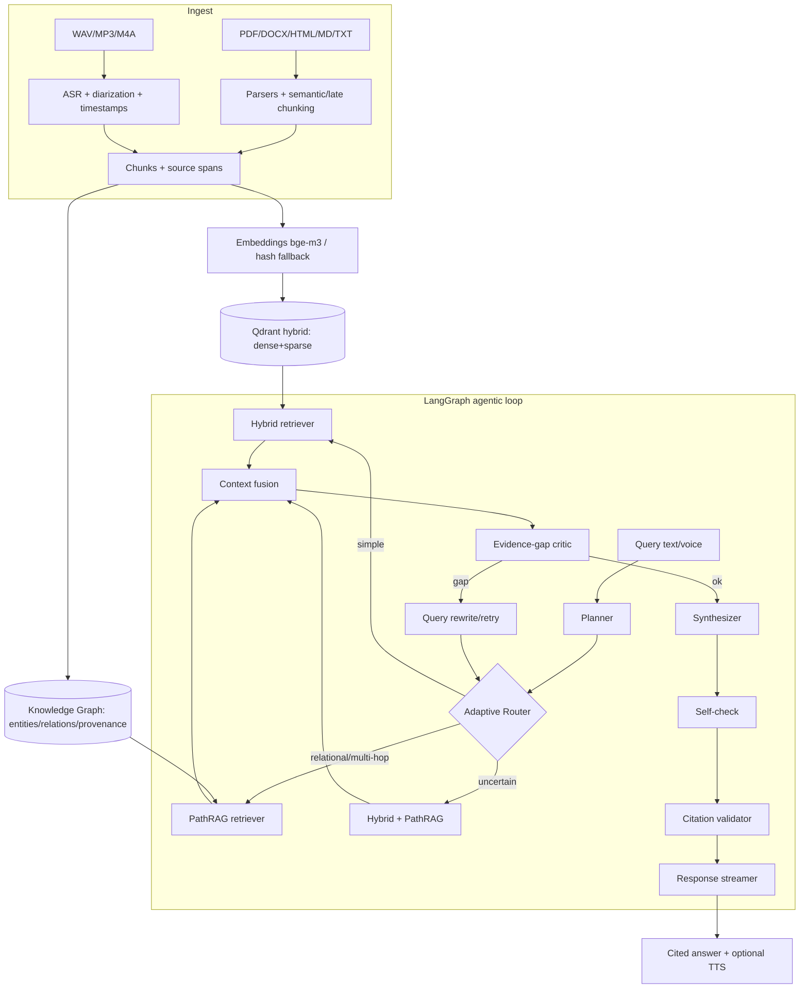

<div align="center">

# 🎙️ Auralynq

### *Talk to Your Data*

A **local-first, agentic, voice-enabled RAG platform** with hybrid vector retrieval,
a relational knowledge graph, and **PathRAG** graph reasoning — grounded answers with
citations, source spans, speaker labels, and timestamps. Runs at **$0** on a laptop;
upgrades to GPU models and paid providers via environment variables.

[Quickstart](#-quickstart-podman) · [Architecture](#-architecture) · [Benchmarks](#-benchmarks) · [Decisions](DECISIONS.md) · [Attributions](THIRD_PARTY.md)

</div>

---

## One-line pitch

**Auralynq** lets you talk — by text or voice — to your own documents and audio, and
get grounded, cited answers, optionally spoken back, with an adaptive agent that routes
simple queries to fast hybrid retrieval and relational/multi-hop queries to PathRAG.

## Demo


> `docs/demo.gif` is a placeholder — generate it with `make demo` then record the UI.

## Why this is technically interesting

- **Adaptive agentic loop** (LangGraph) with explicit latency budgets, iteration caps,
  an evidence-gap critic, query-rewrite retries, self-check, and a citation validator that
  keeps unsupported claims out of answers.
- **PathRAG** graph retrieval — relational path expansion with **flow-based pruning**,
  path-reliability scoring, and golden-region path-to-text ordering.
- **Hybrid retrieval** — dense + sparse vectors, reciprocal rank fusion, cross-encoder
  reranking, MMR de-duplication, and lost-in-the-middle reordering.
- **Voice-native** — push-to-talk → VAD → ASR → agent → grounded answer → TTS, with
  **speaker-aware, timestamped citations**.
- **Runs at $0** — every heavy/paid backend (bge-m3, Qdrant, Whisper, pyannote, Kokoro,
  langgraph, ragas) is optional and has a deterministic offline fallback (see
  [ADR-0003](DECISIONS.md)). Upgrading is a config flag, not a code change.
- **Honest evaluation** — every benchmark number is produced by `make eval`/`make bench`.

## 🏗 Architecture



See [DECISIONS.md](DECISIONS.md) for the architectural rationale.

## 🚀 Quickstart (Podman)

> Auralynq is **Podman-first** and does **not** require Docker.

```bash
# 0. (optional) only needed for gated models/datasets (e.g. diarization)
cp .env.example .env && echo "HUGGINGFACE_TOKEN=hf_..." >> .env

# 1. Install (light deps; $0; offline-capable)
make setup

# 2. Verify container runtime + start the full stack (Qdrant, API, worker, UI, Phoenix)
make runtime-check
make stack-up

# 3. Or run end-to-end locally without containers:
make data        # download sample text + voice datasets
make index       # build vector index + knowledge graph
make demo        # ingest -> index -> ask (text + voice), prints cited answers

# 4. Ask something:
auralynq ask "How does PathRAG prune relational paths?"
auralynq talk    # push-to-talk voice loop
```

Open the UI at **http://localhost:3000**, the API docs at **http://localhost:8000/docs**,
and Phoenix traces at **http://localhost:6006**.

## ⚙️ Configuration

All config is via env vars (prefix `AURALYNQ_`, nested with `__`). See [`.env.example`](.env.example).

| Variable | Default | Purpose |
|----------|---------|---------|
| `HUGGINGFACE_TOKEN` | _(empty)_ | Only required for gated HF assets (diarization, some datasets) |
| `AURALYNQ_EMBEDDING__PROVIDER` | `auto` | `auto`/`bge`/`hash`/`openai` |
| `AURALYNQ_VECTOR__BACKEND` | `auto` | `auto`/`qdrant`/`memory` |
| `AURALYNQ_LLM__PROVIDER` | `auto` | `auto`/`ollama`/`openai`/`anthropic`/`extractive` |
| `AURALYNQ_VOICE__ASR_PROVIDER` | `auto` | `auto`/`faster_whisper`/`whisperx`/`null` |
| `AURALYNQ_VOICE__TTS_PROVIDER` | `auto` | `auto`/`kokoro`/`null` |
| `AURALYNQ_AGENT__MAX_ITERS` | `3` | Retry cap for the rewrite loop |
| `AURALYNQ_AGENT__LATENCY_BUDGET_MS` | `15000` | Agent latency budget |

## 🔌 Providers

| Capability | Local default ($0) | Optional upgrade | Required env |
|------------|--------------------|------------------|--------------|
| Embeddings | `BAAI/bge-m3` → hashing fallback | OpenAI embeddings | `OPENAI_API_KEY` |
| Vector DB  | Qdrant (Podman) → in-memory fallback | Qdrant Cloud | `AURALYNQ_VECTOR__URL` |
| Rerank     | `bge-reranker-v2-m3` → lexical fallback | Cohere rerank | `COHERE_API_KEY` |
| LLM        | Ollama local → extractive fallback | OpenAI / Anthropic | `OPENAI_API_KEY` / `ANTHROPIC_API_KEY` |
| ASR        | faster-whisper → null passthrough | WhisperX align | `HUGGINGFACE_TOKEN` (diarization) |
| TTS        | Kokoro-82M → silent/sine fallback | — | — |
| Tracing    | in-process spans | Phoenix / Langfuse | `LANGFUSE_*` |

## 📊 Benchmarks

> Numbers are produced **only** by the evaluation harness (`make eval` / `make bench`)
> and written to `reports/`. Anything not yet measured is marked **pending**.

| Metric | naive | hybrid | PathRAG | full agentic |
|--------|-------|--------|---------|--------------|
| Ragas faithfulness | _pending_ | _pending_ | _pending_ | _pending_ |
| Answer relevancy   | _pending_ | _pending_ | _pending_ | _pending_ |
| Context precision  | _pending_ | _pending_ | _pending_ | _pending_ |
| Recall@k           | _pending_ | _pending_ | _pending_ | _pending_ |
| nDCG@10            | _pending_ | _pending_ | _pending_ | _pending_ |
| MRR                | _pending_ | _pending_ | _pending_ | _pending_ |
| Latency p50 (ms)   | _pending_ | _pending_ | _pending_ | _pending_ |

ASR WER and Qdrant quantization recall/latency/memory trade-offs: **pending** (`make bench`).

Run `make eval && make bench` to regenerate this section from `reports/`.

## Architecture notes

- Lightweight typed core (pydantic v2) with provider factories that resolve `auto` by
  probing env keys + importable packages, then fall back deterministically.
- Agent runs as a typed state machine; with `langgraph` installed it compiles a real
  `StateGraph`, otherwise an equivalent native executor runs the same node functions.
- Every node emits a trace span; the trajectory is returned in API responses and rendered
  in the UI trace panel.

## Design decisions

See [DECISIONS.md](DECISIONS.md).

## Limitations

- Offline fallbacks (hash embeddings, extractive LLM) are for reproducibility/CI, not
  quality — real metrics require the `embeddings`/`agent`/`voice` extras.
- KG is NetworkX + JSON (laptop-scale); swap for a graph DB at larger scale.
- Diarization needs `HUGGINGFACE_TOKEN` and accepted pyannote model terms.

## Roadmap

- [ ] Streaming partial ASR in the WebSocket loop
- [ ] Graph-DB backend option for the KG
- [ ] Multi-tenant collections + auth
- [ ] Langfuse + OTLP dashboards out of the box

## License

[Apache-2.0](LICENSE). Third-party components attributed in [THIRD_PARTY.md](THIRD_PARTY.md).
